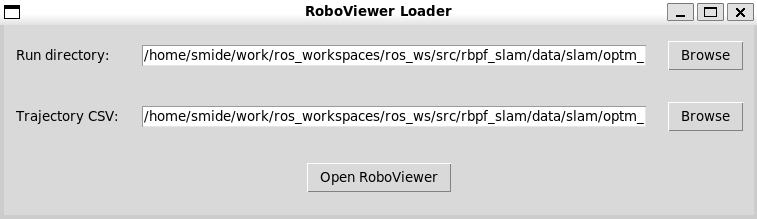
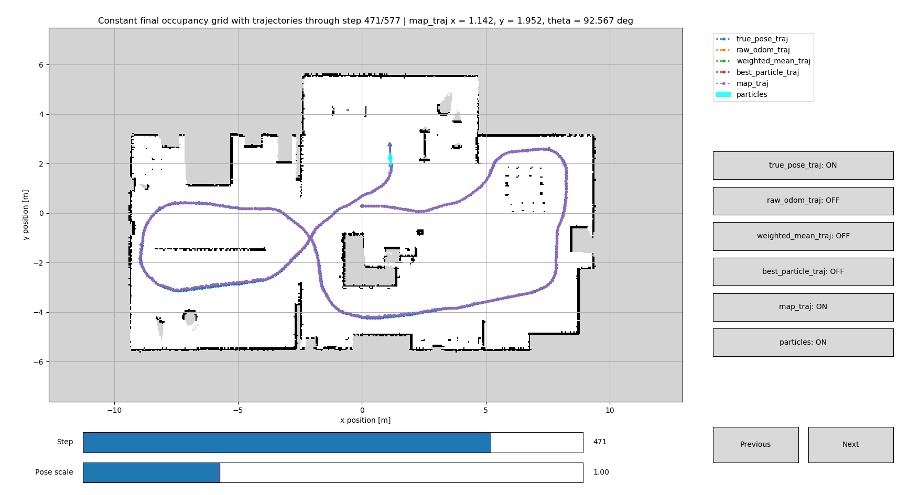

# RBPF SLAM System with Optimized Proposal Distribution


This project is a **real-time ROS** implementation of the **Rao-Blackwellized Particle Filter (RBPF) SLAM**
algorithm with an **optimized proposal distribution** for a simulated mobile robot (**Gazebo**). The system
estimates the pose of the robot while simultaneously building a **2D occupancy grid map (OGM)** of the
environment. Besides the ROS nodes, the project contains **tuning pipelines** to efficiently tune the model
parameters, as well as the corresponding framework.


## Features

The system consists of multiple components:

- **Real-Time RBPF SLAM** algorithm with optimized proposal distribution
    - Probabilistic motion and measurement models
    - **ICP**-based **Scan Matcher**
    - **Proposal Estimator** approximating the optimized proposal distribution with a Gaussian
    - **Occupancy Grid Mapping** algorithm to build the 2D grid map
    - **Resampler** with an adaptive resampling strategy
- **ROS / Gazebo integration**
    - **ROS** nodes for synchronized sensor processing and SLAM execution
    - Differential-Drive Mobile Robot (DDMR) in **Gazebo**
    - RViz visualization
- **Tuning and evaluation framework**
    - **Multiprocessing** implementation of the pipelines to speed up the tuning process
    - Tuning pipelines for:
        - Scan Matcher
        - Single-particle RBPF
        - Multiple-particle RBPF
- **RoboViewer**
    - Visualizes information such as trajectories and maps stored by the evaluation framework
    - Provides a GUI to select the data to display
- **Performance Optimization**
    - **Vectorized NumPy** implementation in key algorithm parts such as **Point-Cloud Downsampling** or
      **Outlier Rejection** in ICP
    - **Numba** function implementation for further speedup in other algorithm parts such as **Ray Casting** in
      the **measurement model**


## RBPF SLAM Algorithm

The core of this project is a **Rao-Blackwellized Particle Filter (RBPF) SLAM** algorithm with an optimized
proposal distribution.
In SLAM, the goal is to estimate the robot trajectory $x_{1:t}$ and the map $m$ from the control inputs
$u_{1:t}$ and sensor measurements $z_{1:t}$:

```math
p(x_{1:t}, m \mid z_{1:t}, u_{1:t})
```

The key idea of RBPF SLAM is to **factorize the posterior** into two separate parts. The first part is the
**trajectory estimation**, and the second part is the **map estimation** based on the estimated trajectory:

```math
p(x_{1:t}, m \mid z_{1:t}, u_{1:t})
=
p(m \mid x_{1:t}, z_{1:t})
\cdot
p(x_{1:t} \mid z_{1:t}, u_{1:t})
```

In this project, trajectory estimation is performed by a **particle filter**, while **Occupancy Grid Mapping**
is used to estimate the map. Each particle in the algorithm contains its own pose, map, and weight.

Conceptually, a particle is therefore a set:

```math
X_t^{[i]}
=
\left(
x_{1:t}^{[i]}, m_t^{[i]}, w_t^{[i]}
\right)
```

### Optimized Proposal Distribution

A standard particle filter uses the **motion model** directly as its **proposal distribution**:

```math
x_t^{[i]}
\sim
p(x_t \mid x_{t-1}^{[i]}, u_t)
```

This is simple, but it has an important disadvantage: the current laser measurement $z_t$ is **not considered
when sampling the new particle pose**. Only the odometry source is used. Since the odometry source is
**quite noisy**, the difference between the proposal and the actual **target distribution** can be large.

In this case, a **large number of samples** is needed to capture the meaningful area of the target distribution.
Many particles also end up in regions where the target distribution has a low value and therefore receive a
**low weight**. This wastes particles. Since every particle needs to be processed, it is also a **waste of
computational resources**.

A better proposal incorporates the current **measurement together with the odometry** information to find the
**meaningful area of the target distribution**:

```math
q(x_t)
\approx
p(x_t \mid x_{t-1}, u_t, z_t, m_{t-1})
```

The exact distribution is difficult to compute for the nonlinear scan-matching and occupancy-grid measurement
models used in this project. Instead, the proposal is **approximated locally by a Gaussian**:

```math
q(x_t)
\approx
\mathcal{N}(\mu_t, \Sigma_t)
```

For each particle, the proposal is estimated approximately as follows:

1. The **kinematic motion model** predicts the next pose from the wheel odometry.
2. The **ICP scan matcher** corrects this prediction using the current laser scan and the particle map from $t-1$.
3. A deterministic set of candidate poses is generated around the scan-matched pose.
4. The candidates are evaluated according to the product of the **measurement and motion models**.
5. Their weighted distribution is **approximated by a Gaussian** with the following mean and covariance matrix.

For all $x_j \in \{x_1, \ldots, x_k\}$:

```math
\mu_t^{(i)}
=
\mu_t^{(i)}
+
p(z_t \mid m_{t-1}^{(i)}, x_j)
p(x_t \mid x_{t-1}^{(i)}, u_t)
```

```math
\eta^{(i)}
=
\eta^{(i)}
+
p(z_t \mid m_{t-1}^{(i)}, x_j)
p(x_t \mid x_{t-1}^{(i)}, u_t)
```

Normalize the mean:

```math
\mu_t^{(i)}
=
\frac{\mu_t^{(i)}}{\eta^{(i)}}
```

Finally, compute the covariance matrix.

For all $x_j \in \{x_1, \ldots, x_k\}$:

```math
\Sigma_t^{(i)}
=
\Sigma_t^{(i)}
+
(x_j - \mu_t^{(i)})
\cdot
(x_j - \mu_t^{(i)})^T
\cdot
p(z_t \mid m_{t-1}^{(i)}, x_j)
\cdot
p(x_t \mid x_{t-1}^{(i)}, u_t)
```

Normalize the covariance matrix:

```math
\Sigma_t^{(i)}
=
\frac{\Sigma_t^{(i)}}{\eta^{(i)}}
```

Finally, the new particle pose is sampled from the resulting Gaussian:

```math
x_t^{[i]}
\sim
\mathcal{N}(\mu_t^{(i)}, \Sigma_t^{(i)})
```

And the update of the weight is simply:

```math
\omega_{t}^{(i)} = \omega_{t-1}^{(i)} \cdot \eta^{(i)}
```

Using a measurement-informed proposal concentrates particles in regions that are supported by both **odometry**
and the current laser scan. Compared with using the motion model alone, this generally reduces the variance of
the particle weights and allows the particle filter to make better use of a limited number of particles. The
best parameter set found works with **only 30 particles!**

After sampling the new pose, the particle weight is updated, **resampling** is performed when required, and the
current laser measurement is integrated into the particle's **occupancy grid map**.

The resulting processing flow for each particle is therefore:

```text
Wheel odometry
      ↓
Pose prediction based on robot kinematics
      ↓
ICP scan matching to correct the predicted pose -> starting point of deterministic sampling
      ↓
Evaluate Gaussian using samples, motion model, and measurement model -> N(μ, Σ)
      ↓
Sample new particle pose
      ↓
Particle weight update
      ↓
Adaptive resampling
      ↓
Occupancy-grid map update
```


## Repository Structure

The repository is organized as a ROS1 catkin workspace containing two main ROS packages:

- `rbpf_slam` contains the SLAM algorithm, tuning framework, ROS nodes, evaluation tools, and visualization utilities.
- `rvc_simulation_environment` contains the differential-drive robot model and the Gazebo simulation environments.

The most important directories are organized as follows:

```text
ros_ws/
├── bags/                               # ROS bag recordings
├── src/
│   ├── CMakeLists.txt                  # Catkin workspace CMake configuration
│   │
│   ├── rbpf_slam/                      # RBPF SLAM package
│   │   ├── config/                     # Parameter configurations for the ROS nodes
│   │   ├── data/                       # Playback data, tuning results (traj + maps) and README images/GIFs
│   │   ├── launch/                     # ROS launch files
│   │   ├── msg/                        # Custom ROS message definitions
│   │   ├── rviz/                       # RViz configurations
│   │   ├── scripts/                    # ROS node scripts
│   │   ├── src/                        # SLAM implementation and supporting infrastructure
│   │   ├── CMakeLists.txt
│   │   ├── package.xml
│   │   └── setup.py
│   │
│   └── rvc_simulation_environment/     # Robot and Gazebo simulation package
│       ├── launch/                     # Simulation and robot launch files
│       ├── models/                     # Robot and simulation model definitions
│       ├── worlds/                     # Gazebo simulation worlds
│       ├── CMakeLists.txt
│       └── package.xml
│
└── README.md
```

The `build/` and `devel/` directories generated by `catkin_make` are not shown because they contain generated build
artifacts rather than project source files.

## Clone and Set Up the Workspace

The repository already contains the structure of a ROS1 catkin workspace. First, create a directory for your ROS
workspaces and clone the repository as `ros_ws`:

```bash
mkdir -p ~/work/ros_workspaces
cd ~/work/ros_workspaces

git clone https://github.com/Eiko-Smid/ROS_SLAM_BT.git ros_ws
cd ros_ws
```
**Attention!** We are using the name ros_ws here in the description. When u want to set up the repo under a different name,
feel free to do so, but then you need to follow this tutorial along with your name instead of "ros_ws"!!!

Make sure the ROS Noetic environment is sourced:

```bash
source /opt/ros/noetic/setup.bash
```

Install the ROS dependencies declared by the packages:

```bash
rosdep install --from-paths src --ignore-src -r -y
```
Install all python modules that could not be resolved by rosdep

```bash
python3 -m pip install --user -r src/rbpf_slam/requirements.txt
```

Build the workspace:

```bash
catkin_make
```

Finally, source the newly built workspace:

```bash
source devel/setup.bash
```

The workspace must be sourced in every new terminal before running ROS nodes or Python modules from the project:

```bash
cd ~/work/ros_workspaces/ros_ws
source devel/setup.bash
```

## Running the Project

### Launching the Nodes

The repository contains launch files for different use cases, including:

- occupancy-grid mapping,
- complete RBPF SLAM,
- dataset recording,
- and playback of previously recorded data.

The corresponding files can be found in:

```text
src/rbpf_slam/launch/
```

For example, the RBPF SLAM node can be started using:

```bash
roslaunch rbpf_slam rbpf.launch
```

The exact launch files and configuration files can be adapted depending on the simulation environment and experiment.

The **parameters** for the node are stored in the directory `src/rbpf_slam/config` and can be adjusted. Since the
parameters were tuned to run on multiple maps/seeds, it is recommended **not to change them!**


### Running the Playback Node

The playback node can be used to record the data required by the tuning pipelines. Recorded datasets can be reused
across all three pipelines. The output directory is configured using the `output_dir` parameter, which is defined in:

```bash
src/rbpf_slam/config/playback_params.yaml
```

It is recommended to use the default directory, since the tuning pipeline loads the playback files from that
location. Launching the playback node automatically stores the playback data in the directory and assigns the
current timestamp to ensure unique naming.

Before running the playback node, the map location must be defined inside:

- `src/rbpf_slam/launch/playback.launch`

Define the map path using the argument `world_name`.

It is recommended to define the map name using the parameter `map_name`. Another useful option is to define a tag
containing information about the run using the parameter `tag`.

The uncertainty of the laser scanner can be defined inside `playback.launch` with the parameters:

- `laser_range_resolution`
- `laser_noise_type`
- `laser_noise_mean`
- `laser_noise_stddv`

Finally, the node can be launched with the following command after sourcing the environment:

```bash
roslaunch rbpf_slam playback.launch
```

The data is stored automatically, and the node can be shut down when the user decides to stop recording.
After shutdown, the data should be available in the folder:

```bash
src/rbpf_slam/data/python_playback
```

The stored data is named using the current timestamp.


### Using the Tuning Pipeline

The tuning pipelines can be used to tune the scan matcher and the actual RBPF algorithm. As mentioned above, it is
recommended to leave the parameters as they are.

However, to run the RoboViewer, it is necessary to run at least one of the following tuning pipelines once with
the standard parameters:

- RBPF tuning pipeline: `python3 -m slam.optimize_rbpf.tune_rbpf`
- RBPF tuning pipeline with multiple particles:
  `python3 -m slam.optimize_rbpf_multiple_particles.tune_rbpf`
- Scan matcher tuning pipeline (not for RoboViewer): `python3 -m slam.optimize_rbpf_scan_matcher.tune_rbpf_scan_matcher`

This generates the data that can then be visualized by the RoboViewer. The data will be available in one of the
following folders, depending on which tuning pipeline was used:

```bash
src/rbpf_slam/data/slam/optimization_results
```

```bash
src/rbpf_slam/data/slam/optm_results_mult_part
```

```bash
src/rbpf_slam/data/scan_matching/optimization_results
```

Attention: The scan matcher tuning pipeline results cannot be visualized by the RoboViewer!

If one of the two RBPF tuning pipelines has been run, a folder whose name is defined by the parameter `STORAGE_DIR`
inside the corresponding tuning file (the same file used to run the Python scripts; see above) will be created.

The content of the subfolder looks as follows:

- `steps.csv`
- `runs`
    - `AWS_Robot_Maker_Bookstore_1782917349_7f47dcf1cbd1_23` (`map name_playbackid_paramid_seed`)
        - `log_odds_map_metadata.json`
        - `log_odds_map.npy`
        - `particles.npy` (optional)

File/folder explanation (only for RBPF tuning, not for scan matcher tuning):

`steps.csv`
- Contains the information, parameters, and metrics for each step, sorted by the rank of the corresponding run.

`runs`
- Folder containing a subfolder for each map, parameter, and seed combination used in the optimization run.

`log_odds_map_metadata.json`
- Contains metadata for the run.

`log_odds_map.npy`
- Contains the compressed occupancy grid map.

`particles.npy`
- Optional file containing the pose of each particle at each step of the corresponding run.
- Currently, the file is always saved when the global variable `KEEP_STEP_RESULTS` is set to `True` in the tuning file.

If the parameters should actually be tuned, they must be adjusted in the corresponding tuning file. Each file
contains the function `grid_axes`, where the parameters to be used for the search can be defined. Additionally, the
`ExperimentParams` in each file can be changed manually, for example the `ICPParams`, which control the ICP
algorithm behavior.

All three tuning pipelines produce the following files:

- params.json
    - Overview of the parameters used for the tuning process
- summary_agg_dataset_id_param.csv
    - The ranked summary results aggregated by dataset ID and parameter hash
- summary_agg_param.csv
    - The summary_agg_dataset_id_param results aggregated by parameter hash
    - This view shows which parameter set won by score
- summary_rank_scored.csv
    - The summary of all individual runs, ranked by score
- summary_ranked_param_overview.csv
    - The rank order of summary_agg_param showing all used parameters
- trace_steps.csv
    - The individual steps of each run, sorted by the score of the runs


Sorting is always from lowest to highest score -> a lower score is better!

Finally, the most important parameters of the tuning pipelines are discussed.

Parameters common to all pipelines:

- NUMBER_OF_WORKERS
    - The number of workers to use for the parallelized tuning pipeline (Default = 4)
    - None -> Use all CPU cores
- KEEP_STEP_RESULTS
    - When True, the step results are stored; otherwise, they are not
    - Recommended to set this to False for large runs (high number of parameters or steps in playback data)
- N_PLAYBACK_STEPS
    - The number of steps from the playback data to use. None -> Use all steps
    - Otherwise, only N steps are used from the chosen playback files
- PLAYBACK_DATA_LIST
    - Defines the playback data used in the tuning pipeline
    - Add one PlaybackDataset instance and the timestamp of the playback file to be used for each file
- SEED_LIST
    - Defines the seeds used for the run
- MEASUREMENT_STDDEV
    - Defines the standard deviation of the measurements. Default is 0.03. Adjust as needed!
    - Recommended to set this to zero if the measurement in the playback data already includes measurement noise
- SUB_DIR 
    - Must be set new in every pipeline run since it defines storage location!
    - Defines the Directory name where the results of the tuning run will be stored inside. 
- MIN_SENSOR_RANGE
    - The minimum sensor range used in the algorithm. Distances below this value are skipped.
- MAX_SENSOR_RANGE
    - The maximum sensor range. Range measurements above this threshold are skipped.

Parameter's only available in the two rbpf tuning pipelines!!!:
- STORE_MAP_DATA
    - If True, the map of each run is stored; otherwise, it is not
    - Recommended to set to False for large runs!


### Using the RoboViewer

The RoboViewer enables the user to visualize trajectories and the map. When the true robot pose is known, the
trajectories estimated by the RBPF SLAM algorithm can be compared against it! In order for the viewer to work,
one of the RBPF tuning pipelines must have been run once. For more information, see the section
"Using the Tuning Pipeline" above.

The viewer is started using the following command:

```bash
python3 -m slam.robo_viewer.robo_viewer_launcher
```

The first step is to select the run folder whose data should be displayed, for example:

`AWS_Robot_Maker_Bookstore_1782917349_7f47dcf1cbd1_22`

Description:

- map name: `AWS_Robot_Maker_Bookstore`
- playback_id: `1782917349`
- parameter hash: `7f47dcf1cbd1`
- seed: `22`

The second step is to choose the corresponding step data. If the folder name above was, for example,
`proposal_optm_1_14`, then the `steps.csv` file from this folder needs to be selected.

If both have been selected, the view should look as follows:

<p align="center">
  
</p>

Clicking the "Open RoboViewer" button starts the actual viewer, and a version of the following screen opens:

<p align="center">
  
</p>

The buttons on the right can be used to enable/disable trajectories and the particle cloud. The "step" bar controls
the current active step and can be controlled using the left mouse button. Finally, the scale of the trajectories
and particles can be changed using "Pose scale".
